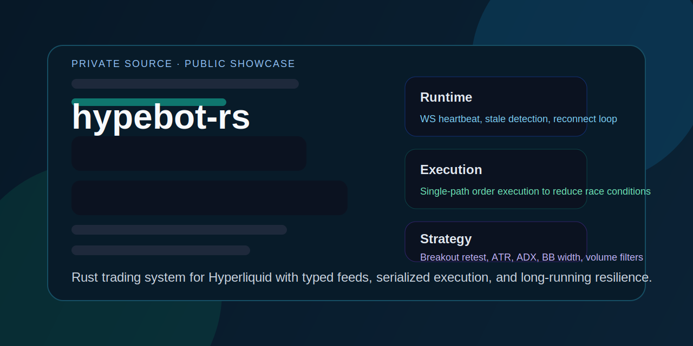
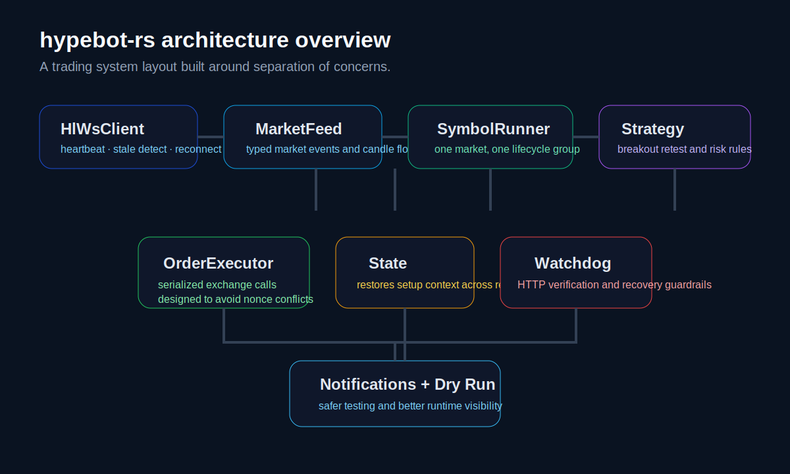

  

  
  
  
  

  <a href="https://github.com/YSKM523/hypebot-rs-showcase/issues/new">Request walkthrough</a> ·
  <a href="./CHANGELOG.md">View changelog</a> ·
  <a href="https://github.com/YSKM523">GitHub profile</a>

# hypebot-rs Showcase

Public-facing home for `hypebot-rs`.

`hypebot-rs` is a Rust-based Hyperliquid trading bot built with a production-minded architecture: typed market data pipelines, per-symbol runners, serialized order execution, persistent state, dry-run support, and long-running websocket resilience.

## Snapshot

- Product status: active development
- Code visibility: private source, public showcase
- Domain: crypto trading infrastructure
- Runtime model: async Rust service for long-running operation
- Public signal: architecture notes, engineering direction, and progress updates live here

## Product Story

Most trading bot repositories show signal logic first and everything else as an afterthought. That usually means brittle runtime behavior, weak execution discipline, and poor recoverability once the process has been running for hours or days.

`hypebot-rs` is being built from the opposite direction. The goal is not just to generate entries and exits. The goal is to run a strategy system with clearer execution boundaries, stronger process isolation, and better operational reliability under continuous market conditions.

This project is especially focused on the parts that separate a toy bot from a serious one:

- websocket lifecycle management that can survive disconnects and stale feeds
- serialized order execution to reduce exchange-side race conditions and nonce issues
- isolated per-symbol task groups so one market does not contaminate the rest of the system
- persisted local bot state so strategy context can be restored after restarts
- dry-run and notification layers that make iteration safer and easier to observe

The result is not positioned as a generic bot template. It is positioned as a trading system implementation with real engineering intent.

## Contact Buttons

## Architecture Preview

### Architecture Notes

The project is intentionally split into distinct layers rather than mixing strategy, transport, and execution logic together:

- `HlWsClient` handles websocket subscriptions, heartbeat, stale-feed detection, and reconnect flow
- `MarketFeed` turns raw exchange events into strategy-ready market signals
- `SymbolRunner` owns the lifecycle for a single market, including warmup, feed startup, strategy loop, order execution, and watchdog behavior
- `OrderExecutor` serializes exchange calls so order placement and cancellation stay disciplined
- strategy modules stay separate from transport and execution concerns
- local state files preserve setup context across process restarts

That separation is one of the strongest parts of the project. It makes the codebase easier to evolve, easier to reason about, and much closer to production service design than the average trading bot repository.

## What Makes It Strong

- Rust rewrite instead of a direct scripting-layer port
- typed websocket and REST integrations for Hyperliquid
- per-symbol isolated task orchestration
- serialized execution path designed to avoid nonce collisions
- persistent state restoration for long-running strategies
- dry-run mode for safer testing
- Discord notification pipeline for runtime observability
- strategy logic that goes beyond simple crossover signals

## Strategy Direction

The current public signal centers on a breakout-retest approach with layered filters:

- structure break detection
- retest confirmation windows
- ADX trend strength gating
- ATR-based buffers and stop logic
- Bollinger Band width filtering
- volume ratio checks
- time filters and cooldown handling

That matters because it shows the bot is not just "buy when X crosses Y." There is a real attempt to encode market structure, volatility context, and execution discipline into the strategy layer.

## Why This Repo Is Public

The implementation repository is currently private while the trading system continues to evolve. This public repo exists so people can see what is being built, understand the engineering direction, and follow the progress of `hypebot-rs` without exposing the full source code.

## Current Roadmap

- expand strategy coverage beyond the current breakout-retest path
- improve runtime observability and operator-facing diagnostics
- deepen recovery logic around reconnects, stale state, and partial execution edge cases
- strengthen execution safety and reporting around orders, stops, and close flows
- continue refining the public-facing presentation of the project

## Next Version Plan

### Runtime

- improve service-level visibility for connection health, task health, and execution outcomes
- add clearer startup and recovery reporting for long-running sessions
- harden edge-case handling around disconnects and state restoration

### Strategy

- continue refining breakout-retest behavior under different volatility regimes
- add additional strategy modules so the architecture proves it can support multiple approaches cleanly
- improve parameter documentation and evaluation notes

### Execution

- deepen execution reporting around resting, filled, canceled, and failed order states
- improve stop placement and recovery handling after partial or abnormal exchange responses
- keep tightening the boundary between strategy intent and execution reality

### Public-facing

- publish more architecture notes and annotated previews
- sharpen project positioning around reliable trading system engineering
- keep this showcase updated as the private implementation matures

## Changelog

- Latest public-facing updates: [CHANGELOG.md](./CHANGELOG.md)
- Current milestone: first public showcase is live

## Repositories

- Public showcase: [YSKM523/hypebot-rs-showcase](https://github.com/YSKM523/hypebot-rs-showcase)
- Private source repository: `YSKM523/hypebot-rs`

## Contact

- GitHub profile: [@YSKM523](https://github.com/YSKM523)
- Project showcase: [YSKM523/hypebot-rs-showcase](https://github.com/YSKM523/hypebot-rs-showcase)
- Walkthrough / collaboration interest: [open an issue](https://github.com/YSKM523/hypebot-rs-showcase/issues/new)
- Progress log: [CHANGELOG.md](./CHANGELOG.md)
