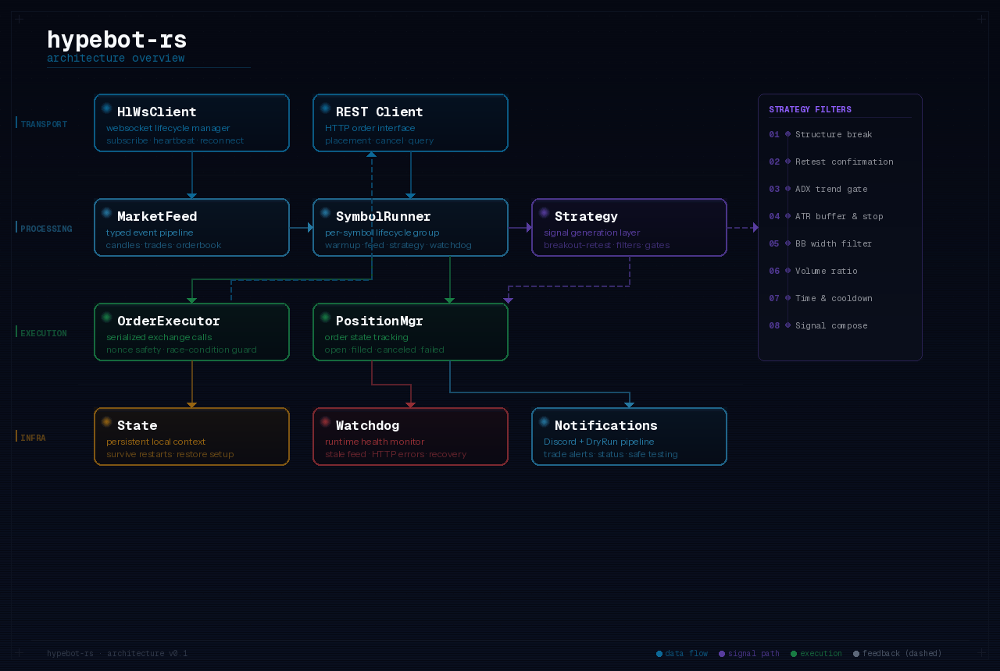

  

  
  
  
  

  <a href="https://github.com/YSKM523/hypebot-rs-showcase/issues/new">Request walkthrough</a> ·
  <a href="./CHANGELOG.md">Changelog</a> ·
  <a href="https://github.com/YSKM523">@YSKM523</a>

# hypebot-rs

A Rust-based Hyperliquid trading bot built with production-grade architecture: typed market data pipelines, per-symbol runners, serialized order execution, persistent state, dry-run support, and long-running websocket resilience.

> The implementation repository is private. This showcase exists to share what is being built, the engineering direction, and progress — without exposing the full source.

## Why This Exists

Most trading bot repos show signal logic first and treat everything else as an afterthought — brittle runtimes, weak execution discipline, poor recoverability. `hypebot-rs` is built from the opposite direction: **reliability first, then strategy.**

The focus is on the parts that separate a toy bot from a serious one:

- **Websocket resilience** — lifecycle management that survives disconnects, stale feeds, and reconnect storms
- **Serialized execution** — single-path order flow to eliminate exchange-side race conditions and nonce collisions
- **Per-symbol isolation** — independent task groups so one market never contaminates another
- **Persistent state** — local bot state restored across restarts so strategy context isn't lost
- **Safe iteration** — dry-run mode and Discord notifications for runtime observability

## Architecture

The system is split into four distinct layers:

| Layer | Components | Responsibility |
|-------|-----------|----------------|
| **Transport** | `HlWsClient`, `REST Client` | Websocket subscriptions, heartbeat, reconnect flow, HTTP order interface |
| **Processing** | `MarketFeed`, `SymbolRunner`, `Strategy` | Typed event pipeline, per-symbol lifecycle, signal generation |
| **Execution** | `OrderExecutor`, `PositionMgr` | Serialized exchange calls, order state tracking |
| **Infrastructure** | `State`, `Watchdog`, `Notifications` | Persistent context, runtime health monitoring, Discord alerts + dry-run |

## Strategy

Current strategy centers on a **breakout-retest approach** with layered filters:

1. Structure break detection
2. Retest confirmation windows
3. ADX trend strength gating
4. ATR-based buffers and stop logic
5. Bollinger Band width filtering
6. Volume ratio checks
7. Time filters and cooldown handling

Not "buy when X crosses Y" — this encodes market structure, volatility context, and execution discipline into the strategy layer.

## Roadmap

**Runtime** — improve connection health visibility, startup/recovery reporting, edge-case handling around disconnects and state restoration

**Strategy** — refine breakout-retest across volatility regimes, add additional strategy modules, improve parameter documentation

**Execution** — deepen reporting around order states (resting, filled, canceled, failed), improve stop placement and recovery after abnormal responses

## Links

- Showcase: [YSKM523/hypebot-rs-showcase](https://github.com/YSKM523/hypebot-rs-showcase)
- Private source: `YSKM523/hypebot-rs`
- Changelog: [CHANGELOG.md](./CHANGELOG.md)
- Contact: [open an issue](https://github.com/YSKM523/hypebot-rs-showcase/issues/new)
